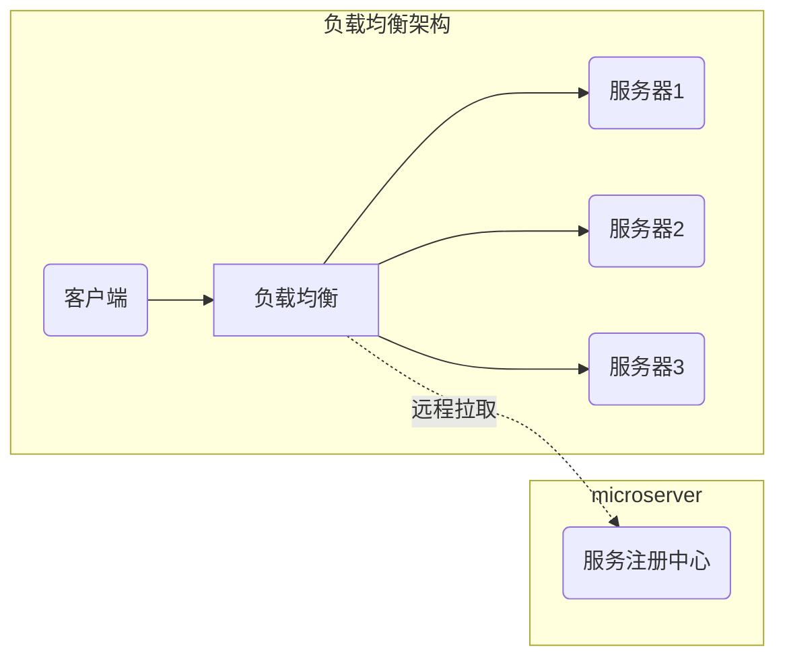

## 微服务学习之Spring Cloud

### 微服务的演进

### 微服务的优缺点

### Spring Cloud系列

#### 服务发现

#### 负载均衡(软件)

​		负载均衡是分布式应用的一个重要组件。通过某一算法(线性轮询、权重、流量负载)对客户端请求进行路由，以达到尽可能的利用服务器资源的目的。

​		在微服务架构中，负载均衡维护的服务器列表是通过服务注册中心进行获取的。

 [spring-cloud-ribbon解析](spring-cloud-ribbon解析.md) 

#### 服务容错

